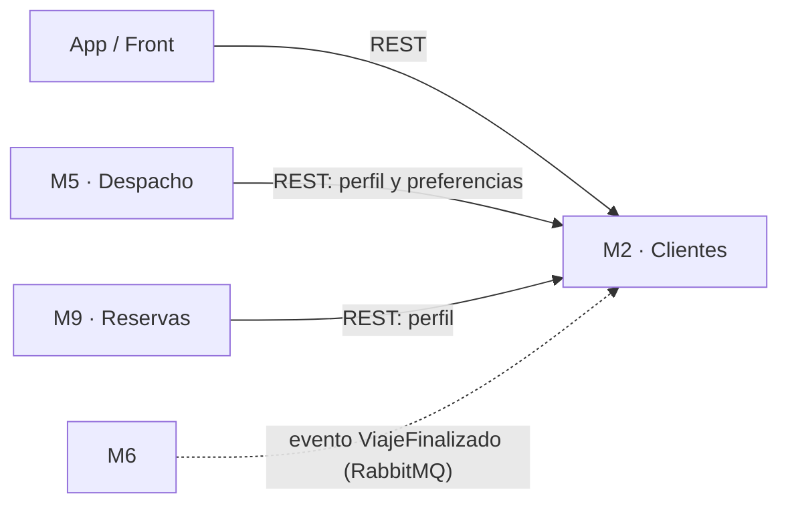

# 🚕 Plataforma de Movilidad Urbana — Módulo M2: Clientes

**Trabajo Práctico Integrador 2026**  
**Institución:** Universidad Tecnológica Nacional – Facultad Regional Resistencia (UTN FRRe)  
**Cátedra:** Desarrollo de Software  

> **En una línea:** M2 es el servicio que *conoce a los pasajeros*. Guarda quiénes son, a dónde suelen ir, cómo les gusta viajar y qué viajes hicieron, y le pasa esa info a los demás módulos cuando la necesitan.

---

## 👥 Equipo

| Integrante | Legajo |
|---|---|
| **Brandt, Carina Noemí** | 24672 |
| **Sonza, Matias Javier** | 26573 |
| **Paluch Ruberto, Julián** | 27229 |
| *[Nombre del Integrante 3]* | *[Legajo 3]* |

---

## 🤔 ¿De qué se trata?

La plataforma es una app de viajes tipo Uber/Cabify, dividida en **módulos** (M1, M2, M3…). Cada módulo es un **microservicio**: un programa independiente, con su propia base de datos, que se encarga de una sola parte del negocio y se comunica con los demás.

A nosotros nos toca **M2: Clientes**. Pensalo como la **"ficha del pasajero"**: todo lo que la plataforma necesita saber de la persona que pide el viaje.

### ¿Qué hace concretamente?

| Requisito | Qué significa en criollo |
|---|---|
| **RF-2.1 / RF-2.6** — Perfil y estado de cuenta | Alta, consulta y modificación de los datos del cliente (nombre, mail, teléfono). También saber si la cuenta está activa o bloqueada: un operador puede bloquear una cuenta, por ejemplo ante un reclamo. |
| **RF-2.2 / RF-2.3** — Direcciones y preferencias | Guardar lugares frecuentes ("Casa", "Facu", "Trabajo") para no escribirlos cada vez, y cómo le gusta viajar: tipo de vehículo, necesidades de accesibilidad, viaje silencioso, etc. |
| **RF-2.4** — Historial de viajes | Un resumen de los viajes que hizo el cliente. No lo calculamos nosotros: nos enteramos cuando otro módulo nos avisa que un viaje terminó. |
| **RF-2.5** — Calificar al conductor | El cliente puntúa al conductor. Si por un corte de internet la app manda la misma calificación dos veces, se guarda **una sola vez**. A eso se le dice ser **idempotente**. |

---

## 🔌 ¿Con quién habla M2?



Hay dos formas de comunicarse:

- **Síncrona (REST), línea llena:** alguien pregunta y M2 responde en el momento. Ejemplo: antes de asignar un conductor, **M5 (Despacho)** necesita saber si el pasajero pidió un vehículo con accesibilidad.
- **Asíncrona (eventos), línea punteada:** **M6** avisa *"terminó un viaje"* y sigue con lo suyo, sin esperar respuesta. Si M2 justo está caído, el mensaje queda guardado en la cola de RabbitMQ y lo procesamos cuando volvemos. Nadie se queda esperando a nadie.

Además, cada pedido que llega trae un **token de Keycloak** que dice quién es el usuario y qué rol tiene (`Cliente`, `Conductor` u `Operador`). Así sabemos, por ejemplo, que solo un operador puede bloquear una cuenta.

---

## 🧰 ¿Qué vamos a usar y para qué?

| Herramienta | Para qué la usamos | ¿Por qué esta? |
|---|---|---|
| **Python 3.12 + FastAPI** | Construir la API REST | Es rápido de escribir, valida los datos solo y genera la documentación interactiva (Swagger) automáticamente. |
| **Pydantic** | Definir cómo es un Cliente, una Dirección, etc. | Si alguien manda un mail mal escrito o le falta un campo, la API lo rechaza sola con un error claro, sin escribir validaciones a mano. |
| **MySQL** | Perfil y estado de cuenta | Datos con estructura fija y operaciones críticas (como bloquear una cuenta) que tienen que quedar consistentes. Una base relacional con transacciones es lo ideal. |
| **MongoDB** | Direcciones y preferencias | Un cliente puede tener 0 o 10 direcciones y preferencias distintas a las de otro. Un documento JSON flexible se adapta mejor que una tabla rígida. |
| **RabbitMQ** | Recibir eventos de otros módulos (ej. `ViajeFinalizado`) | Desacopla: los módulos no necesitan estar todos prendidos al mismo tiempo para comunicarse. |
| **Redis** | Caché de perfiles | M5 y M9 consultan perfiles todo el tiempo. Tenerlos en memoria evita ir a la base en cada pedido y las respuestas salen más rápido. |
| **Keycloak** | Login y roles | Es el servidor de identidad compartido por toda la plataforma (configurado en [keycloak/](keycloak/)). No reinventamos la autenticación: solo validamos el token. |
| **Docker + docker-compose** | Levantar todo con un comando | Todos corremos exactamente las mismas versiones. Generamos imágenes versionadas (formato estándar OCI), así "en mi máquina anda" deja de ser excusa. |

> 💡 Usar dos bases de datos distintas tiene nombre: **persistencia políglota**. La idea es simple: usar la herramienta adecuada para cada tipo de dato, en vez de meter todo a la fuerza en una sola.

### 12-Factor App, en dos patadas

El servicio sigue la metodología **12-Factor App** (RNF-06). En la práctica significa:

- **La configuración no va en el código.** URLs de las bases, contraseñas y puertos van en variables de entorno (`.env`). El mismo código corre en tu compu, en la de un compañero o en un servidor; lo único que cambia es el `.env`.
- **El servicio no guarda nada "adentro".** Todo lo importante vive en las bases de datos, así que podemos apagar el contenedor y levantar otro (o tres) sin perder información.
- **Dependencias explícitas.** Todo lo que hace falta para correrlo está en `requirements.txt` y en la imagen Docker.

---

## 🚦 ¿En qué estado está?

- [x] API base con FastAPI y documentación Swagger
- [x] Alta, listado y consulta de clientes (con direcciones y preferencias) en MongoDB
- [x] Validación de datos con Pydantic (incluye formato de email)
- [ ] Pasar la configuración a variables de entorno (`.env`)
- [ ] Modificación de perfil, estado de cuenta y bloqueos, guardados en MySQL (RF-2.1 / RF-2.6)
- [ ] Escuchar `ViajeFinalizado` en RabbitMQ para armar el historial (RF-2.4)
- [ ] Calificaciones idempotentes (RF-2.5)
- [ ] Caché de perfiles con Redis
- [ ] Validar el token de Keycloak en cada endpoint
- [ ] Dockerizar el servicio completo (hoy solo MongoDB corre en Docker)

---

## 🚀 Probalo en tu máquina

Necesitás **Docker** y **Python 3.12+**.

```bash
cd m2-clientes
docker compose up -d              # levanta MongoDB
python -m venv venv
source venv/bin/activate          # en Windows: .\venv\Scripts\activate
pip install -r requirements.txt
uvicorn main:app --reload
```

Abrí **http://localhost:8000/docs** y vas a ver Swagger: una página donde podés probar cada endpoint desde el navegador, sin instalar nada más.

### Endpoints disponibles hoy

| Método | Ruta | Qué hace |
|---|---|---|
| `POST` | `/api/v1/clientes` | Crea un cliente con sus direcciones y preferencias |
| `GET` | `/api/v1/clientes` | Lista todos los clientes |
| `GET` | `/api/v1/clientes/{id_mongo}` | Trae un cliente por su ID (`400` si el ID tiene un formato inválido, `404` si no existe) |

Ejemplo de cliente para crear con el `POST`:

```json
{
  "nombre": "Ana",
  "apellido": "Gómez",
  "email": "ana.gomez@gmail.com",
  "telefono": "3624123456",
  "direcciones": [
    {
      "etiqueta": "Casa",
      "calle": "Av. Sarmiento",
      "numero": "1500",
      "ciudad": "Resistencia",
      "es_principal": true
    }
  ],
  "preferencias": {
    "viaje_silencioso": true,
    "temperatura_aire": "Fría",
    "musica": "Rock"
  }
}
```

Más detalle sobre cómo correrlo en [m2-clientes/README.md](m2-clientes/README.md).

---

## 📁 Estructura del repo

```
2026-01-TPI/
├── keycloak/                 # Servidor de identidad (login y roles) + configuración del realm
└── m2-clientes/              # Nuestro microservicio
    ├── main.py               # Endpoints de la API
    ├── models.py             # Cómo es un Cliente, una Dirección y las Preferencias
    ├── database.py           # Conexión a MongoDB
    ├── requirements.txt      # Librerías de Python
    └── docker-compose.yml    # MongoDB local
```

---

<details>
<summary><b>📖 Mini glosario (para quien no viene del palo)</b></summary>

- **Microservicio:** un programa chico e independiente que hace una sola cosa bien y se comunica con otros por la red.
- **API REST / endpoint:** la "ventanilla" del servicio. Cada endpoint es una URL a la que le pedís algo (`GET` para consultar, `POST` para crear, etc.).
- **Evento / cola de mensajes:** un aviso que un servicio deja en una cola ("terminó un viaje") para que otro lo lea cuando pueda.
- **Caché:** una copia rápida en memoria de datos que se piden seguido, para no ir a buscarlos a la base cada vez.
- **Contenedor (Docker):** una "cajita" que trae el programa con todo lo que necesita para correr, igual en cualquier máquina.
- **Token:** una credencial digital que dice quién sos y qué permisos tenés, sin mandar la contraseña en cada pedido.
- **Idempotente:** que hacer la misma operación una o diez veces da el mismo resultado.

</details>
